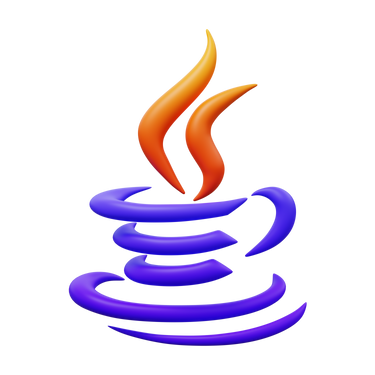
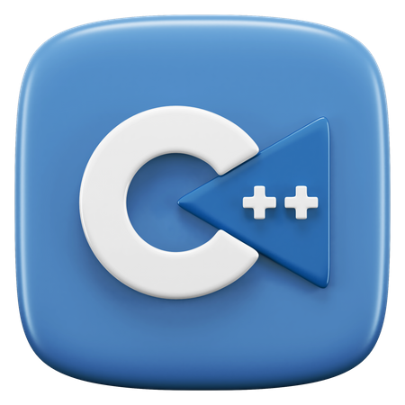
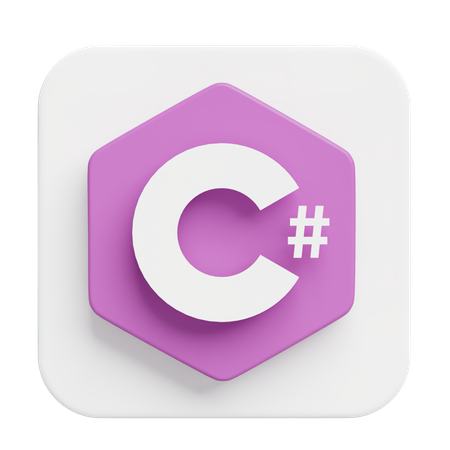

&nbsp;
&nbsp;
&nbsp;
&nbsp;
&nbsp;

# 🚀 Strivers A2Z DSA Course Sheet


Welcome to the ultimate playground for data structures and algorithms enthusiasts! This repository is your go-to destination for solving the challenges outlined in Striver's DSA Sheet, a premier resource for honing your coding skills and acing those technical interviews.

## 🌟 Overview

DSA Sheet Solutions: A comprehensive collection of solutions for data structures and algorithms problems based on popular DSA sheets. Designed to help with mastering core concepts and improving problem-solving skills. Solutions are implemented in various programming languages for diverse practice.

## 🗂️ Repository Structure

Dive into the world of solutions with our organized folders:

- [**Step 1** : Learn the Basics.](./Step%201%20%20Learn%20the%20Basics/)


## 🚀 Getting Started

1. **Clone the Repository**

   Unleash the power of these solutions by cloning the repo:

   ```bash
   git clone https://github.com/yourusername/strivers-dsa-sheet-solutions.git 
   ```

2. **Navigate to Your Favorite Languagey**

   Choose your weapon of choice and navigate to the folder:

   ```bash
   cd strivers-dsa-sheet-solutions/Python  # or Java, C++
   ```


3. **Explore and Conquer**

  Browse through the solutions and challenge yourself to implement or improve upon them. Each file is a step towards mastery!


## 🤝 Contributing
Your insights and solutions can make this repo even better! If you have a solution or improvement to contribute, don’t hesitate to open a pull request. Let’s make this repository the best place for DSA practice together!

## 📜 License
This repository is licensed under the MIT License. Check out the LICENSE file for more details.

## 🎉 Acknowledgments
- Striver: For crafting the DSA Sheet that’s fueling our coding adventures.
- The Open Source Community: For endless inspiration and support.


_Feel free to adjust any part of this to better fit your style or add any additional details!_

### Happy coding! 🚀